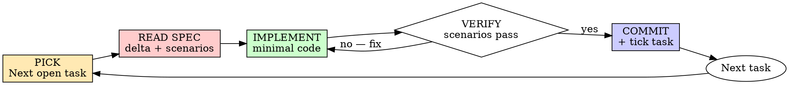

# OpenSpec: Apply

## Overview

This skill maps to OpenSpec's `/opsx:apply` step. It's how you turn an approved change folder (`openspec/changes/<change-id>/`) into working, spec-compliant code.

**Core principle:** Every task closes a spec delta. A task is "done" only when its scenarios pass — not when the code "looks right."

**Announce at start:** "I'm using the openspec-apply skill to implement <change-id>."

## When to Use

You have:
- An approved OpenSpec change at `openspec/changes/<change-id>/`
- A `tasks.md` (and ideally a detailed plan from `writing-plans`)
- A clean working tree on the change branch (use `using-git-worktrees`)

If any of those are missing, go back: brainstorming → openspec-propose → writing-plans first.

## The Iron Law

```
A TASK IS DONE ⇔ ITS SPEC SCENARIOS ARE VERIFIABLY SATISFIED
```

"It compiles," "it looks right," "I tested it manually" — none of these close a task. The scenarios in the spec delta are the acceptance criteria. Until they're satisfied (with evidence), the task is open.

## The Cycle (per task)



### 1. PICK
Open `openspec/changes/<change-id>/tasks.md`. Pick the first unchecked task. Find which spec delta(s) it cites.

### 2. READ SPEC
Open `openspec/changes/<change-id>/specs/<capability>/spec.md`. Read the requirement and **every scenario** for it. Those scenarios are your acceptance criteria — copy them into a TodoWrite checklist for this task.

If a scenario is ambiguous, **stop and clarify with the user**. Do not guess.

### 3. IMPLEMENT
Write the minimum code that makes every scenario satisfiable.

- YAGNI: don't add behavior the spec doesn't require
- DRY: don't duplicate; reuse existing utilities
- Follow the file structure from the plan / design.md
- Add automated checks for each scenario where practical (unit tests, integration tests, runtime assertions). The spec drives *what* to verify; you choose the most appropriate verification mechanism.

### 4. VERIFY
For each scenario, demonstrate it's satisfied. Acceptable evidence, in order of preference:

1. An automated test mirroring the GIVEN/WHEN/THEN that runs and passes
2. A reproducible command output that matches the THEN clause
3. A manual walkthrough — only when automation is genuinely impractical, and you must explicitly note this

If any scenario is not satisfied, return to step 3. Don't move on with red scenarios.

### 5. COMMIT
- Stage the implementation + verification artifacts (tests, fixtures, etc.)
- Commit message: `<type>(<change-id>): <task summary>` — e.g. `feat(add-retry-logic): implement exponential backoff`
- Tick the box in `tasks.md` and commit that change too (or amend)

### 6. NEXT
Move to the next unchecked task in `tasks.md`.

## Verification vs. TDD

SDD does **not** require you to write tests *before* code. It requires that the spec exists before code, and that scenarios are verifiably satisfied before a task closes. You may write tests first, alongside, or after — whichever produces the strongest evidence the scenario is met.

That said: writing the verification first (especially as automated tests) is usually the fastest path to "demonstrably satisfies the scenario," because you avoid the trap of "I'll add tests later and they pass on the first try" — which proves nothing.

## When the Spec Is Wrong

You will hit cases where the spec turns out to be incomplete or contradictory once you start implementing. **Do not silently fix it in code.** Instead:

1. STOP implementation
2. Document the gap: which scenario is missing/ambiguous, what you discovered
3. Update the spec delta in `openspec/changes/<change-id>/specs/...` (and `design.md` / `tasks.md` if needed)
4. Re-confirm with the user
5. Resume

The spec is the source of truth. If the truth is wrong, fix the truth — don't route around it.

## Code Organization

- Keep files focused. One responsibility per file. Files that change together live together.
- If a file grows beyond ~300 lines or starts mixing concerns, split it — but only if the plan/design supports the split. Otherwise, flag it as a concern and continue.
- In existing codebases, follow established patterns even when they're not what you'd choose greenfield.

## Self-Review (per task, before commit)

- [ ] Every scenario for this task's requirement(s) has demonstrable evidence
- [ ] No code added that isn't required by some delta in this change
- [ ] No spec delta touched by this task is left in an inconsistent state
- [ ] `tasks.md` checkbox accurately reflects state
- [ ] Commit message references the change-id

If any box is unchecked, the task is not done.

## Final Sweep (after last task)

Before declaring the change implemented:

1. **Open every spec delta in the change.** For each requirement, confirm at least one verification artifact exists and passes.
2. **Open `tasks.md`.** Confirm every box is ticked. Untick any that are aspirational rather than verified.
3. **Diff against the active spec set** (`openspec/specs/`) to make sure no `MODIFIED` or `REMOVED` requirement was lost.
4. **Run the full project test/build/lint suite.** Output must be pristine.

Then hand off to `superspecs:requesting-code-review`. After review, run `superspecs:openspec-archive` to fold deltas into the active spec set.

## Red Flags — STOP

- "I implemented something not in the spec because I noticed we needed it" → either add it to the spec via a proposal update, or remove it
- "This scenario is hard to verify, I'll just trust the code" → the scenario is the contract; verify it or change it
- "I ticked the task before checking the scenarios" → untick, verify, retick honestly
- "Tests pass but they don't actually exercise the scenario" → rewrite the test against the scenario's GIVEN/WHEN/THEN
- "The spec disagrees with what I built — I'll just adjust the spec quietly" → no. Update the spec deliberately, with the user, and re-verify

## Common Rationalizations

| Excuse | Reality |
|--------|---------|
| "Spec is overkill for this small task" | The spec already exists. Read it. |
| "I know what the user wants" | The scenarios know better. Read them. |
| "I'll verify everything at the end" | Each task verifies its own scenarios. End-only verification = bug factory. |
| "The scenario is poorly worded but I get it" | Then rewrite it before implementing. Future-you and reviewers won't get it. |
| "Tests after will achieve the same thing" | Maybe — but only if they actually mirror the scenario. Most "tests after" don't. |
| "I'll just add a small extra feature while I'm here" | YAGNI. Out-of-scope code in this change pollutes the spec story. |

## Integration

**Required predecessors:**
- `superspecs:openspec-propose` — the change folder must exist and be approved
- `superspecs:writing-plans` — for detailed per-task steps
- `superspecs:using-git-worktrees` — isolated branch for the change

**Required successors:**
- `superspecs:requesting-code-review` — between tasks and at the end
- `superspecs:openspec-archive` — once merged, fold deltas into the active spec set
- `superspecs:finishing-a-development-branch` — merge / PR / cleanup

**Alternative execution modes (still apply this skill's rules):**
- `superspecs:subagent-driven-development` — fresh subagent per task
- `superspecs:executing-plans` — batch execution with human checkpoints
