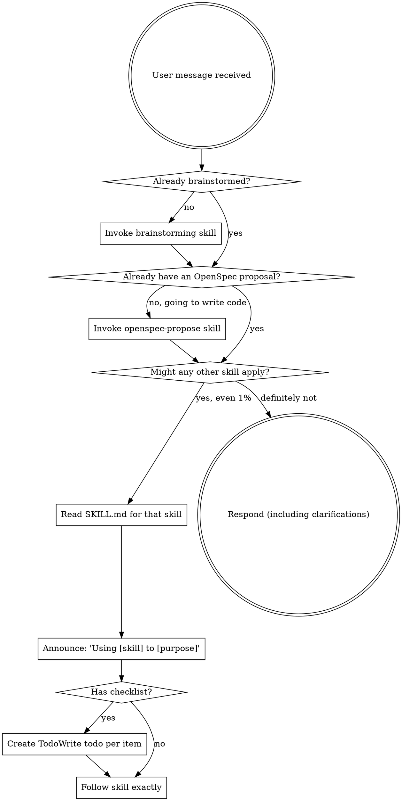

<SUBAGENT-STOP>
If you were dispatched as a subagent to execute a specific task, skip this skill.
</SUBAGENT-STOP>

<EXTREMELY-IMPORTANT>
If you think there is even a 1% chance a skill might apply to what you are doing, you ABSOLUTELY MUST invoke the skill.

IF A SKILL APPLIES TO YOUR TASK, YOU DO NOT HAVE A CHOICE. YOU MUST USE IT.

This is not negotiable. This is not optional. You cannot rationalize your way out of this.
</EXTREMELY-IMPORTANT>

## What Is SuperSpecs?

SuperSpecs is a **Spec-Driven Development (SDD)** skills framework for Cursor. Instead of jumping straight into code, you:

1. **Brainstorm** the idea into a clear design
2. **Propose** an OpenSpec change (`proposal.md`, `specs/`, `design.md`, `tasks.md`)
3. **Plan** the work as bite-sized tasks linked to spec deltas
4. **Apply** the change task-by-task, with each task verified against the spec
5. **Archive** the completed change so the active spec set stays current

The spec — not a failing test — is the source of truth. Every task either implements a delta in the spec or it shouldn't be in the plan.

## Instruction Priority

SuperSpecs skills override default system prompt behavior, but **user instructions always take precedence**:

1. **User's explicit instructions** (direct requests, project rules) — highest priority
2. **SuperSpecs skills** — override default system behavior where they conflict
3. **Default system prompt** — lowest priority

If the user says "skip the spec, just do it," follow the user. The user is in control.

## How to Access Skills

In Cursor, skills are exposed as files under `skills/<skill-name>/SKILL.md` inside this plugin. To "invoke" a skill, **read its `SKILL.md` with the Read tool**, then follow the instructions in it directly. Cursor's plugin loader pre-loads each skill's `name` and `description` (from frontmatter) at session start so you can decide which skills to load.

**When in doubt, read the skill.** Don't paraphrase what you remember — the skill body contains the discipline that matters.

# Using Skills

## Skip skills when

The 1% rule does **not** require ceremony for tasks where no skill plausibly applies. Skip the skill machinery for:

- **Read-only inspection** — "what does this file do?", "show me the imports". Example: *"read README.md and summarize it"*.
- **Formatting / whitespace** — running a formatter, fixing trailing whitespace, sorting imports. Example: *"run prettier on src/"*.
- **Single-line typo fixes** — a docstring spelling fix, a comment correction. Example: *"fix the typo 'recieve' → 'receive' in handler.ts"*.
- **Exploratory shell commands** — `ls`, `git log`, `git status`, `npm ls`. Example: *"what's the current git branch?"*.
- **Direct questions about the repo or skills themselves** — answer the question; do not open a brainstorm. Example: *"what does the `spx:openspec-archive` skill do?"*.

For these, answer or act directly. If the task expands beyond the bypass case mid-response (a "typo fix" turns into a refactor, an "inspection" becomes a redesign), invoke the relevant skill at that point.

This list is the bypass clause that the Red Flags table below references. A flowchart longer than the answer is its own anti-pattern.

## Mode override: `SUPERSPECS_MODE`

The environment variable `SUPERSPECS_MODE` lets the user override the default triggering posture:

| Value      | Behaviour |
|------------|-----------|
| `strict`   | The 1% rule applies to every request, including bypass cases. Use during onboarding, audits, or eval runs. |
| `auto`     | **Default.** 1% rule applies unless the request matches a documented "Skip skills when" case. |
| `manual`   | Skills only run when explicitly invoked by the user (`use spx:<name>` or `/<command>`). For experienced users who want a quiet agent. |

The mode governs agent behaviour (there is no enforcement at the tool layer that can stop the agent). `superspecs doctor` reports the effective mode and flags an unrecognized value (e.g. a typo like `stict`) so misconfiguration is caught, but the agent is still responsible for honouring the mode. Document the value the user chooses in the chat, and respect it for the session.

## The Rule

**Invoke relevant or requested skills BEFORE any response or action.** Even a 1% chance a skill might apply means that you should invoke the skill to check. If an invoked skill turns out to be wrong for the situation, you don't need to use it. Exception: requests that match the **Skip skills when** list above — for those, answer directly.

## Red Flags

These thoughts mean STOP—you're rationalizing:

| Thought | Reality |
|---------|---------|
| "This is just a simple question" | Simple questions get direct answers (see "Skip skills when" above). Check for skills only when a skill plausibly applies. A flowchart longer than the answer is its own anti-pattern. |
| "I need more context first" | Skill check comes BEFORE clarifying questions. |
| "Let me explore the codebase first" | Skills tell you HOW to explore. Check first. |
| "Let me gather information first" | Skills tell you HOW to gather information. |
| "This doesn't need a formal skill" | If a skill exists, use it. |
| "I remember this skill" | Skills evolve. Read current version. |
| "This doesn't count as a task" | Action = task. Check for skills. |
| "The skill is overkill" | Simple things become complex. Use it. |
| "I'll just do this one thing first" | Check BEFORE doing anything. |
| "I know what SDD means" | Knowing the concept ≠ using the skill. Invoke it. |
| "Skipping the spec just this once" | That's exactly when you need it. |

## Skill Priority

When multiple skills could apply, use this order:

1. **Process skills first** (`spx:brainstorming`, `spx:openspec-propose`, `spx:systematic-debugging`) — these determine HOW to approach the task
2. **Implementation skills second** (`spx:writing-plans`, `spx:openspec-apply`, `spx:subagent-driven-development`) — these guide execution
3. **Cleanup skills last** (`spx:openspec-archive`, `spx:finishing-a-development-branch`)

"Let's build X" → `spx:brainstorming` first, then `spx:openspec-propose`, then `spx:writing-plans`.
"Fix this bug" → `spx:systematic-debugging` first; if the fix changes spec'd behavior, `spx:openspec-propose` before coding.

## Skill Types

**Rigid** (`spx:openspec-propose`, `spx:openspec-apply`, `spx:systematic-debugging`): Follow exactly. Don't adapt away discipline.

**Flexible** (patterns): Adapt principles to context.

The skill itself tells you which.

## User Instructions

Instructions say WHAT, not HOW. "Add X" or "Fix Y" doesn't mean skip workflows. The spec-driven workflow is the *how*; the user's request is the *what*.
